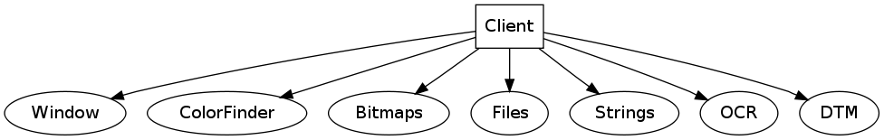

Client Class
============

The ``TClient`` class is the class that glues all other MML classes together
into one usable class. Internally, quite some MML classes require other MML
classes, and they access these other classes through their "parent" ``TClient``
class.

An image tells more than a thousands words:

    

And the class dependency graph: (An arrow indicates a dependency)

.. image:: ../../Pics/client_classes_dependencies.png
    
The client class does not do much else except creating the classes when it is
created and destroying the classes when it is being destroyed. 
