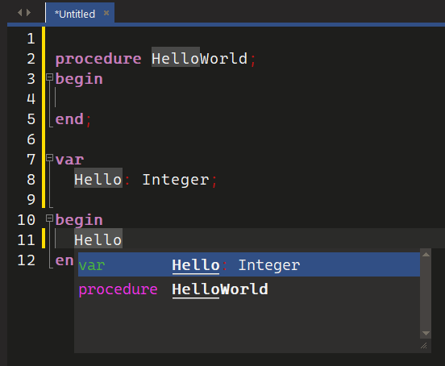
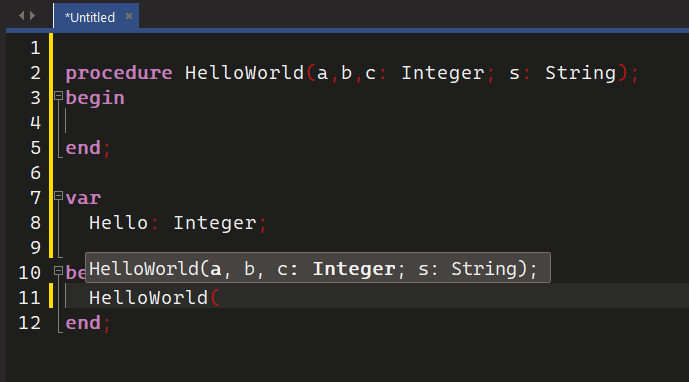
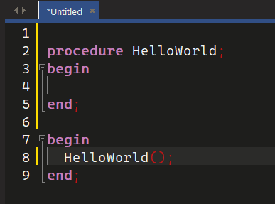
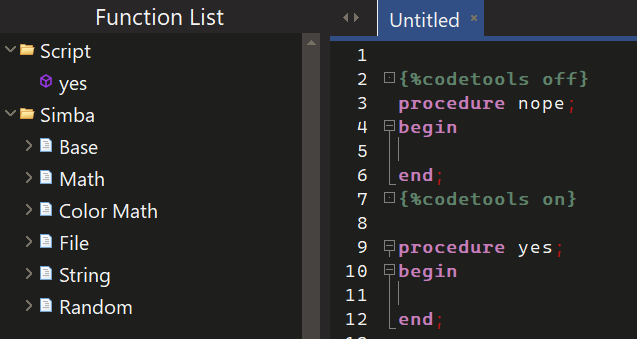
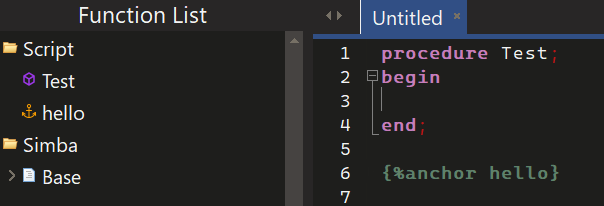

#########
Codetools
#########

Codetools provides multiple tools to aid programming in Simba.

.. note :: Some customization is available in Simba's settings. :code:`Settings > Code Tools` 

Completion box
""""""""""""""

:code:`Control + Space` or typing :code:`.` will open the completion box, which shows all available declarations. 

-----

Parameter hints
"""""""""""""""

:code:`Control + Shift + Space` or typing :code:`(` will open parameter hints, to show what parameters are required for the method(s).

-----

Jump to declaration
"""""""""""""""""""

:code:`Control + mouse click` will jump to the declaration.

.. note :: If the declaration is a simba method (or a plugin) the declaration will be printed in the output. 

-----

IDE directives
""""""""""""""

IDE directives are similar to compiler directives. They are enclosed by curly brackets with an opening percentage sign. For example: 

:code:`{% ide_directive}`

The compiler sees them simply as comments which it ignores. 

-----

Codetools
---------

- Enable or disable codetools the :code:`nope` procedure does not show in the function list.

.. code-block::

	{%codetools off}
	{%codetools on}

-----

Anchor
------

Insert an "anchor" into the function list to mark named sections and such.

.. code-block::

	{%anchor hello}

