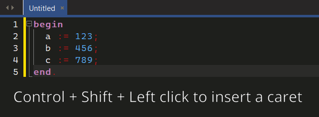
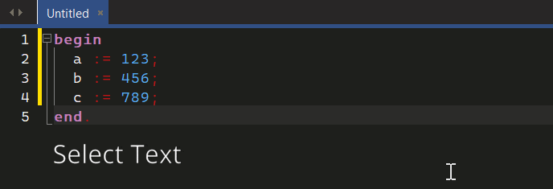
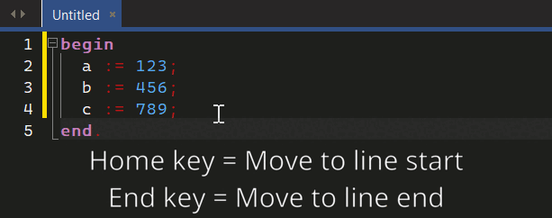

###########
Multi Caret
###########

The editor allows multiple carets with pressing :code:`Shift`, :code:`Control` and :code:`Left Click`.

Individually adding carets
""""""""""""""""""""""""""

Adding carets to a selection
""""""""""""""""""""""""""""

Moving to start or end of line
""""""""""""""""""""""""""""""

Press the :code:`Home/End` key to move to the :code:`Start/End` of the lines.

