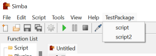

Simba Packages
==============

The Simba package system uses Github releases.

----

Options can be provided if the repository contains `.simbapackage` in the root directory.

```
path=Includes/TestPackage
flat=false

ignore=dir
ignore=bad.simba
ignore=.git

script=script.simba
script=script2.simba
example=example.simba
example=example2.simba
```

- `path` Path to install relative to simba's directory. 
- `flat` When installing do not build directory structure. Extract all files to the root directory.
- `ignore` File or directory not to install.
- `example` Will add a script to the "Open Example" window which is opened via the file menu.
- `script` Will add a script to the menu bar.

  
*(package menu)*

  
*(package example)*

----

Packages can also be hosted outside of Github using the following data.

This will be the URL which is used to add the package.  
Example: www.test.com  
```json  
  {
    "name" : "My package name",
    "full_name" : "Something/My package name",
    "description" : "This is a test package",
    "homepage_url" : "www.test.com"
  }
```

For version data "versions" is appended to the above url.  
Example: www.testversions.com
```json
  [
    {
      "download_url" : "www.test.com/files.zip",
      "options_url" : "www.test.com/.simbapackage",
      "notes" : "notes about this version",
      "time" : "unixtimestamp",
      "name" : "versionname"
    },
    {
      "download_url" : "www.test.com/files.zip",
      "options_url" : "www.test.com/.simbapackage",
      "notes" : "notes about this version",
      "time" : "unixtimestamp",
      "name" : "versionname"
    }
  ]
```