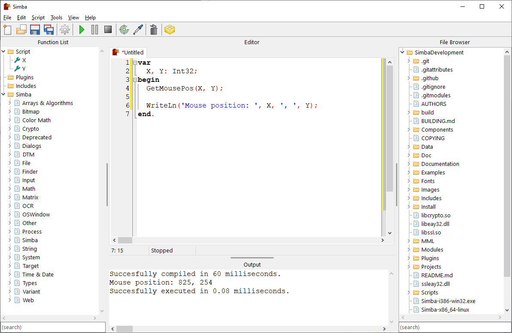

Simba
=====

Simba is a program used to repeat certain (complicated) tasks. Typically these tasks involve using the mouse and keyboard. Simba is programmable, which means you can design your own logic and steps that Simba will follow, based upon certain input such as colours on the screen.

The scripting language used is [Lape](https://github.com/nielsAD/lape) which uses a Pascal-like syntax.

Simba is available for:
 - Windows (32 & 64 bit)
 - Linux (64 bit)
 - ARM (64 bit)
 - MacOS (64 bit)

------
# Building Simba

Simba is a Lazarus project. Version 2.0.10 is available here: https://sourceforge.net/projects/lazarus/files/

If using Linux:
  - `Xtst` is required: `sudo apt-get install libxtst-dev`
  - `gtk2` is required: `sudo apt-get install gtk2.0 libgtk2.0-dev`
  - `libffi` is required: `sudo apt-get install libffi-dev`
  
If using MacOS:
  - `libffi` is required: `brew install libffi`

Steps:
1) Clone the Simba repository & install submodules `git clone --recurse-submodules https://github.com/MerlijnWajer/Simba`. 
2) Open `Simba.lpi` located in `Source/Simba/` in Lazarus.
3) When built the Simba executable will be located in the root directory of the repository. 

-------
### Notes

* If you run into a `Internal error` attempt a **build** rather than **running**. FPC seems to sometimes have an issue with progressive building.